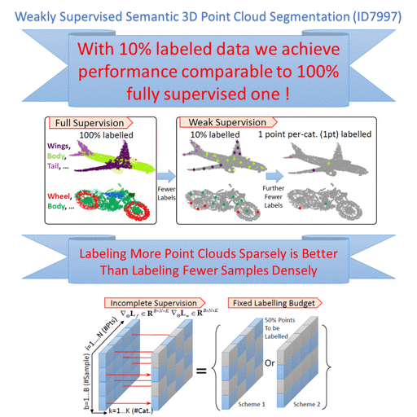

## Weakly Supervised Semantic Point Cloud Segmentation: Towards 10x Fewer Labels
Created by <a href="http://xu-xun.com" target="_blank">Xun Xu</a> and <a href="https://www.comp.nus.edu.sg/~leegh/" target="_blank">Gim Hee Lee</a> from National University of Singapore.

### Introduction
This work is based on our CVPR2020 paper <a href="https://arxiv.org/abs/2004.04091">Weakly Supervised Semantic Point Cloud Segmentation: Towards 10X Fewer Labels</a>. We studied 3D point cloud segmentation under a weakly supervised scenario. It is assumed that only a fraction (less than 10% in our experiments) of points are provided with ground-truth. We revealed that with such few labeled data, semantic segmentation performance is very close to the fully supervised method (100% data points labeled). We further introduce additional constraints for unlabeled data and achieved comparable results to fully supervised ones.

We release tensorflow code for experiments on ShapeNet[1] and S3DIS[2] datasets.

### Citation
Please cite the following work if you feel it is helpful.
@Inproceedings{XuLee_CVPR20,
title={Weakly Supervised Semantic Point Cloud Segmentation: Towards 10x Fewer Labels},
author={Xu, Xun and Lee, Gim Hee},
booktitle={CVPR}
year={2020},
}

### Installation
This code has been tested on Pyhon3.6, TensorFlow1.14, CUDA 10.0, cuDNN 7.0 and Ubuntu 18.04

### Usage
You should first obtain the data for ShapeNet and/or S3DIS by running
	bash prepareDataset_ShapeNet.sh

You can then train the full model by running:
	python train.py

Reference:
[1] Li Yi, Vladimir G Kim, Duygu Ceylan, I Shen, Mengyan Yan, Hao Su, Cewu Lu, Qixing Huang, Alla Sheffer, Leonidas Guibas, et al. A scalable active framework for region annotation in 3d shape collections. ACM Transactions on Graphics, 2016.
[2] Iro Armeni, Ozan Sener, Amir R Zamir, Helen Jiang, Ioannis Brilakis, Martin Fischer, and Silvio Savarese. 3d semantic parsing of large-scale indoor spaces. In CVPR, 2016.